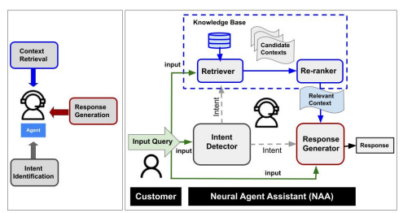

+++
title = "Bringing the State-of-the-Art to Customers: A Neural Agent Assistant Framework for Customer Service Support"
date = 2022-12-07T16:00:00
draft = false

authors = ["Karthik Bhaskar", "Stephen Obadinma", "Faiza Khan Khattak", "Shirley Wang", "Tania Sidhorn", "Elaine Lau", "Sean Robertson", "Jingcheng Niu", "Winnie Au", "Alif Munim"]

# Publication type.
# Legend:

publication_types = ["1"]

# Abstract and optional shortened version.
abstract = "Building Agent Assistants that can help improve customer service support requires inputs from industry users and their customers, as well as knowledge about state-of-the-art Natural Language Processing (NLP) technology. We combine expertise from academia and industry to bridge the gap and build task/domain-specific Neural Agent Assistants (NAA) with three high-level components for: (1) Intent Identification, (2) Context Retrieval, and (3) Response Generation. In this paper, we outline the pipeline of the NAA{'}s core system and also present three case studies in which three industry partners successfully adapt the framework to find solutions to their unique challenges. Our findings suggest that a collaborative process is instrumental in spurring the development of emerging NLP models for Conversational AI tasks in industry. The full reference implementation code and results are available at \url{https://github.com/VectorInstitute/NAA}."

abstract_short = "A Neural Agent Assistant
Framework for Customer Service Support"

# Is this a featured publication? (true/false)
featured = false

# Projects (optional).
projects = ""
categories = ""
tags = "ChatBot"

# Slides (optional).
#   Associate this publication with Markdown slides.
#   Simply enter your slide deck's filename without extension.
#   E.g. `slides = "example-slides"` references 
#   `content/slides/example-slides.md`.
#   Otherwise, set `slides = ""`.
slides = ""

# Links (optional).
url_pdf = "https://aclanthology.org/2022.emnlp-industry.44.pdf"
url_preprint = "https://aclanthology.org/2022.emnlp-industry.44/"
url_code = ""
url_dataset = ""
url_project = ""
url_slides = ""
url_video = ""
url_poster = ""
url_source = ""

# Custom links (optional).
#   Uncomment line below to enable. For multiple links, use the form `[{...}, {...}, {...}]`.
# url_custom = [{name = "Github Repo", url = "https://github.com/antaldaniel/eurobarometer/"}]

# Digital Object Identifier (DOI)
doi = ""

# Does this page contain LaTeX math? (true/false)
math = true

# Featured image
[image]
  # Caption (optional)
  caption = "Neural Agent Assistant"

  # Focal point (optional)
  # Options: Smart, Center, TopLeft, Top, TopRight, Left, Right, BottomLeft, Bottom, BottomRight
  focal_point = "Center"
+++
<p align="center">
    
    <br>
    <em>Fig: Neural Collaborative Filtering</em>
</p>

# Cite 
Consider citing our work as below, if you find it useful in your research:
```
@inproceedings{obadinma-etal-2022-bringing,
    title = "Bringing the State-of-the-Art to Customers: A Neural Agent Assistant Framework for Customer Service Support",
    author = "Obadinma, Stephen  and
      Khan Khattak, Faiza  and
      Wang, Shirley  and
      Sidhorn, Tania  and
      Lau, Elaine  and
      Robertson, Sean  and
      Niu, Jingcheng  and
      Au, Winnie  and
      Munim, Alif  and
      Kalaiselvi Bhaskar, Karthik Raja",
    booktitle = "Proceedings of the 2022 Conference on Empirical Methods in Natural Language Processing: Industry Track",
    month = dec,
    year = "2022",
    address = "Abu Dhabi, UAE",
    publisher = "Association for Computational Linguistics",
    url = "https://aclanthology.org/2022.emnlp-industry.44",
    doi = "10.18653/v1/2022.emnlp-industry.44",
    pages = "440--450",
    abstract = "Building Agent Assistants that can help improve customer service support requires inputs from industry users and their customers, as well as knowledge about state-of-the-art Natural Language Processing (NLP) technology. We combine expertise from academia and industry to bridge the gap and build task/domain-specific Neural Agent Assistants (NAA) with three high-level components for: (1) Intent Identification, (2) Context Retrieval, and (3) Response Generation. In this paper, we outline the pipeline of the NAA{'}s core system and also present three case studies in which three industry partners successfully adapt the framework to find solutions to their unique challenges. Our findings suggest that a collaborative process is instrumental in spurring the development of emerging NLP models for Conversational AI tasks in industry. The full reference implementation code and results are available at \url{https://github.com/VectorInstitute/NAA}.",
}


```

---

